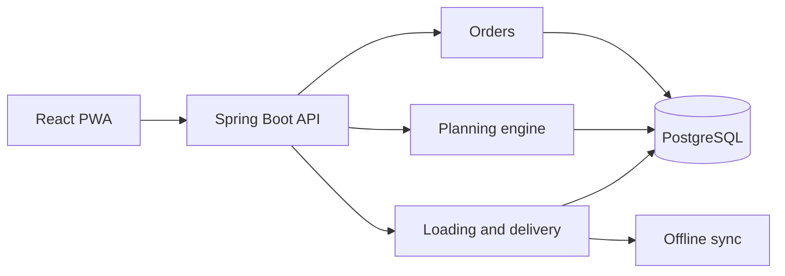

# Architecture

Waypoint is a modular monolith. Controllers call application services, application services own transaction boundaries, and domain services contain business decisions. Feature modules communicate through service contracts and application events rather than repositories.

The first milestone deliberately exposes only a health endpoint while the persistence boundary is established. Authentication and role scoping will be added before business write endpoints are exposed.
